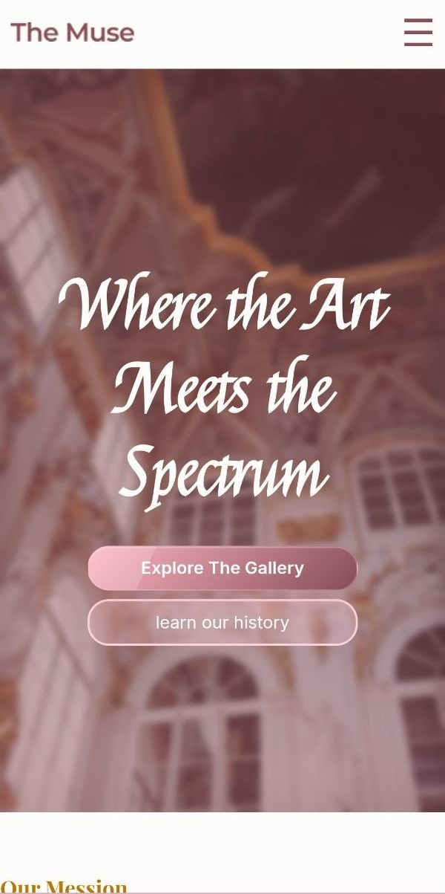
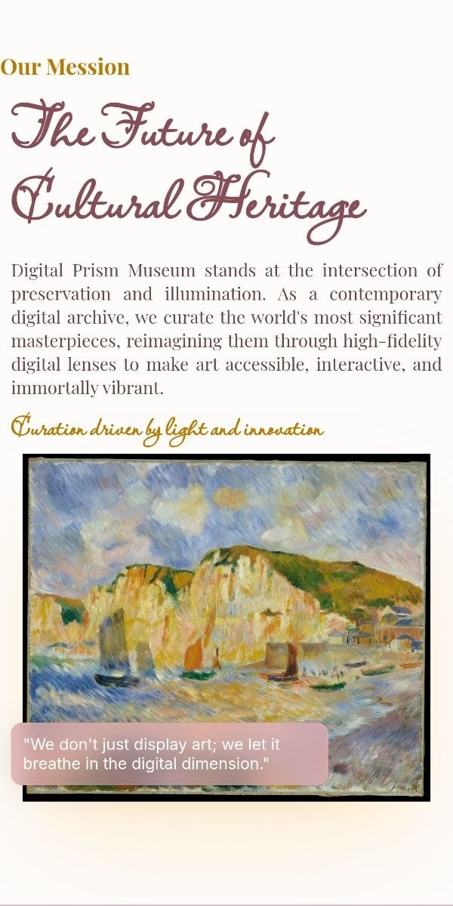

# TheMuse

A Website inspired by "The Met" museum.

> The Metropolitan Museum of Art, colloquially referred to as the Met,  
> is an encyclopedic art museum in New York City.  
> It is the fourth-largest museum in the world and the largest art museum in the Americas.

See the resource on Wikipedia:  
https://en.wikipedia.org/wiki/Metropolitan_Museum_of_Art

# *Currently developed for mobile devices*

  
  &nbsp;
  
  &nbsp;
  

